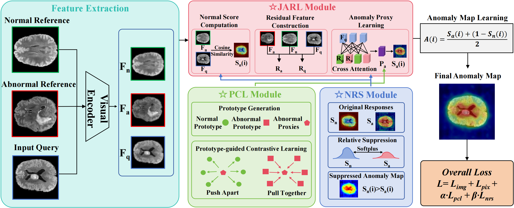

# Learning Relative Abnormal Relations for Generalist Anomaly Detection

[](https://doi.org/10.1016/j.patcog.2026.114773)  [](https://doi.org/10.1016/j.patcog.2026.114773)  <a href="#license"></a>

Official PyTorch implementation of our Pattern Recognition paper: **Learning Relative Abnormal Relations for Generalist Anomaly Detection (LRAR)**.


>**Overview of LRAR.** Given a query image together with normal and abnormal support sets, LRAR first extracts their visual features through a pre-trained visual encoder. Then the Joint Anomaly Residual Learning (JARL) pipeline learns query-specific anomaly proxies from residual features between normal and abnormal supports, producing abnormal response maps. Prototype-guided Contrastive Learning (PCL) further regularizes these proxies through prototype-guided contrastive supervision, while Normal Relative Suppression (NRS) suppresses false-positive responses by enforcing normal-response dominance in anomaly-free regions. The final anomaly map is obtained by fusing normal and abnormal responses.

***Abstract:*** Generalist anomaly detection (GAD) aims to learn transferable anomaly patterns from source domains and generalize them to unseen target domains, which is particularly important for medical image analysis and industrial anomaly diagnosis. Recent residual-based methods have shown promising results by modeling the residuals between query images and reference samples. However, these methods usually learn anomaly representations implicitly, without explicit fine-grained supervision, and often fail to sufficiently suppress false positives in normal regions. This could limit their reliability in medical and industrial scenarios. To address these issues, we propose LRAR, a novel framework for generalist anomaly detection that learns relative abnormal relations. Built upon a joint anomaly residual learning (JARL) pipeline, LRAR includes two key modules. Specifically, we first propose the Prototype-guided Contrastive Learning (PCL) module to enhance anomaly representation learning by explicitly modeling the relative relationships among anomaly proxies and normal–abnormal prototypes. Then, we propose the Normal Relative Suppression (NRS) module to reduce false positives by enforcing the relative dominance of normal responses over anomaly activations in anomaly-free regions. By jointly learning relative relations in both the representation space and the response space, our LRAR produces more discriminative anomaly features and anomaly maps. Extensive experiments on four datasets spanning industrial and medical domains, especially medical datasets, demonstrate that LRAR achieves the best or competitive performance in both image-level detection and pixel-level localization.

## Highlights

- We propose **Learning Relative Abnormal Relations (LRAR)**, a novel residual-based framework for generalist anomaly detection, addressing the lack of explicit fine-grained supervision for anomaly representations and insufficient suppression of false positives.
- We propose a **Prototype-guided Contrastive Learning (PCL)** module to learn more discriminative anomaly representations by explicitly aligning anomaly proxies with abnormal prototypes while separating them from normal prototypes.
- We propose a **Normal Relative Suppression (NRS)** module to reduce false positives by enforcing the relative dominance of normal responses over anomaly activations in anomaly-free regions.
- Extensive experiments on four benchmark datasets, across industrial and medical domains, demonstrate that LRAR achieves the best or competitive performance in both image-level detection and pixel-level localization.

This repository supports training and evaluation on four benchmarks: **MVTec**, **VisA**, **BUSI** and **BraTS**.

## Usage

### Environment Setup
```bash
# python 3.10+, torch with CUDA (developed with torch 2.1.1+cu118)
git clone https://github.com/liukaimingzzx/LRAR.git
cd LRAR
pip install -r requirements.txt
```

### Dataset Preparation
1. Download the four benchmarks: [MVTecAD](https://www.mvtec.com/de/unternehmen/forschung/datasets/mvtec-ad/), [VisA](https://amazon-visual-anomaly.s3.us-west-2.amazonaws.com/VisA_20220922.tar), [BraTS](https://www.kaggle.com/datasets/dschettler8854/brats-2021-task1) and [BUSI](https://www.kaggle.com/datasets/aryashah2k/breast-ultrasound-images-dataset).
2. Organize each dataset in the MVTecAD-style folder structure:
   ```
   /path/to/dataset
    └── dataset_name
        └── class_name
            ├── train/good
            │   ├── 000.png
            │   └── ...
            ├── test
            │   ├── good
            │   │   ├── 000.png
            │   │   └── ...
            │   └── anomaly_type
            │       ├── 000.png
            │       └── ...
            └── ground_truth
                └── anomaly_type
                    ├── 000.png
                    └── ...
   ```
   For example, convert the VisA dataset to the MVTecAD structure by running (details in [this link](https://github.com/amazon-science/spot-diff?tab=readme-ov-file#data-preparation)):
   ```bash
   python dataset_preparation/convert_visa_to_mvtec.py
   ```
3. Generate the dataset metadata files (`meta.json`):
    ```bash
    python dataset_preparation/mvtec.py
    python dataset_preparation/visa.py
    ```


> **Note:** The dataset collection process is implemented in the python class [`FSDataset`](./utils/dataset.py).

### Training

The source and target domains are selected by `--data_mode` together with `--fold`:

| Experiment  | `--data_mode` | `--fold` |
| ----------- | ------------- | -------- |
| MVTec → VisA | `mvtec_visa` | 1 |
| VisA → MVTec | `mvtec_visa` | 0 |
| MVTec → BUSI | `mvtec_busi` | 1 |
| MVTec → BraTS | `mvtec_brats` | 1 |

Here `--data_root` should point to the folder that directly contains `mvtec`, `visa`, `BUSI/Breast` and `brats` (e.g. `./dataset`).

```bash
# Example: train on MVTec, with VisA as the target domain
CUDA_VISIBLE_DEVICES=0 torchrun --nproc_per_node=1 --master_port=1024 train.py \
  --data_root /path/to/dataset \
  --data_mode mvtec_visa \
  --fold 1 \
  --epoch 20 \
  --batch_size 8 \
  --image_size 448 \
  --print_freq 50 \
  --n_shot 1 \
  --a_shot 1 \
  --num_learnable_proxies 25 \
  --save_path ./outputs/mvtec2visa
```

The two modules can be toggled for ablation: `--use_pcl 0/1` (PCL) and `--use_nrs 0/1` (NRS), with weights `--contra_weight` and `--supp_weight`.

### Testing
```bash
CUDA_VISIBLE_DEVICES=0 python test.py \
    --save_path ./outputs/mvtec2visa \
    --image_size 448 \
    --dataset VisA \
    --n_shots 1 \
    --a_shots 1 \
    --num_learnable_proxies 25 \
    --num_seeds 3 \
    --eval_segm \
    --tag default \
    --data_root /path/to/dataset/visa
```
`--dataset` supports `MVTec`, `VisA`, `BUSI` and `BraTS`.

### (Optional) One-step Scripts
After dataset preparation, you can also run the code in one step:
```bash
# mode, gpu, ckpt_save_dir, fold, test_dataset, data_mode
bash run.sh train 0 ./outputs/mvtec2visa 1 visa mvtec_visa
bash run.sh train 0 ./outputs/mvtec2busi 1 busi mvtec_busi
bash run.sh train 0 ./outputs/mvtec2brats 1 brats mvtec_brats
bash run.sh train 0 ./outputs/visa2mvtec 0 mvtec mvtec_visa
# directly test an existing checkpoint on another dataset
bash run.sh test 0 ./outputs/mvtec2visa 1 mvtec
```

## Citation
If you find this repository useful, please consider citing our work:
```bibtex
@article{liu2026lrar,
  title={Learning relative abnormal relations for generalist anomaly detection},
  author={Liu, Kaiming and Wang, Rui and Zheng, Chaoqun and Liu, Hanghang and Zhang, Leyi and Zong, Guohao and Wang, Di and Feng, Weihua and Sun, Yuan},
  journal={Pattern Recognition},
  volume={182},
  pages={114773},
  year={2026},
  doi={10.1016/j.patcog.2026.114773},
  publisher={Elsevier}
}
```

## License
The code in this repository is licensed under the [MIT license](https://mit-license.org/).
